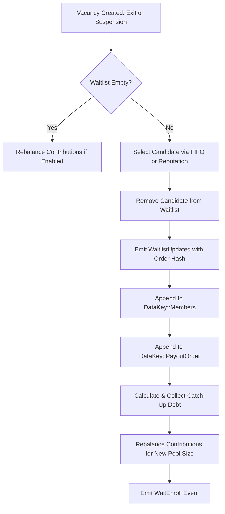

# ROSCA Waitlist Flow

This document details the waitlist mechanism in the `ahjoor-rosca` smart contract. The waitlist allows prospective participants to queue for entry into full or active ROSCA groups and enables automatic promotion when vacancies arise from member exits or default suspensions.

---

## 1. Overview

In the Ahjoor ROSCA protocol, a savings circle has a fixed target membership (`max_members`). When a circle reaches maximum capacity or is actively running, new members cannot join directly. 

The waitlist system provides:
- **Fair Queueing:** Prospective members can register on a waitlist and await an open slot.
- **Automated Slot Filling:** When an active member leaves via an approved emergency exit or is suspended for default, the contract automatically promotes a candidate from the waitlist to replace them.
- **Flexible Prioritization:** Groups can order waitlisted candidates either by first-come, first-served registration order (FIFO) or by on-chain reputation weighting.
- **Solvency & Continuity:** Promoted members settle catch-up contributions for rounds already elapsed, ensuring the pot size and cycle schedule remain intact.

---

## 2. Joining a Waitlist

Prospective participants join a group's waitlist by calling `join_waitlist`.

### Smart Contract Entrypoint

```rust
pub fn join_waitlist(env: Env, caller: Address)
```

### Preconditions & Validation Rules

When `join_waitlist` is called, the contract enforces several safety checks:

1. **Pause State:** The contract must not be in a paused state.
2. **Authentication:** The `caller` must provide cryptographic authorization (`caller.require_auth()`).
3. **Not an Active Member:** The `caller` must not already be in the active member roster (`DataKey::Members`). If already a member, reverts with `Error::AlreadyAMember`.
4. **Not an Exited Member:** The `caller` must not be in the exited members registry (`DataKey::ExitedMembers`). If previously exited, reverts with `Error::MemberHasExited`.
5. **Not Already on Waitlist:** The `caller` must not already be queued in `DataKey2::Waitlist`. Reverts with `"Already on waitlist"` if duplicated.
6. **Waitlist Capacity Cap:** The number of entries in the waitlist cannot exceed `max_members` (defaults to 50 if unspecified). If `waitlist.len() >= max_members`, reverts with `Error::GroupFull`.

### State Updates & Event

Upon successful validation:
- The `(caller, timestamp)` tuple is appended to the waitlist in `DataKey2::Waitlist`, where `timestamp` is the current ledger timestamp.
- Contract instance storage TTL is automatically extended.
- A `WaitlistUpd` event is emitted:
  ```rust
  // Topic: ("WaitlistUpd",) | Data: (caller, joined: true, waitlist_size)
  events::emit_waitlist_updated(&env, caller, true, waitlist.len() as u32);
  ```

---

## 3. Promotion Rules & Order

When an active seat in a ROSCA circle becomes vacant, the contract invokes `try_promote_from_waitlist` to automatically select and onboard a candidate.

### Vacancy Triggers

Promotion from the waitlist is triggered automatically in two scenarios:

1. **Approved Member Exit (`approve_exit`):** When an admin approves an active member's emergency exit request, the exiting member is removed from the active group and a slot is freed.
2. **Default Suspension (`close_round`):** When an active member fails to contribute for consecutive rounds exceeding `max_defaults`, the member is placed in `DataKey::SuspendedMembers`, opening their active slot.

> [!NOTE]
> If a vacancy occurs and the waitlist is empty, no promotion takes place. The contract proceeds gracefully and recalculates contribution amounts among remaining members via `try_rebalance_contribution` if dynamic rebalancing is configured.

### Waitlist Priority Modes

The promotion ordering strategy is governed by `WaitlistMode` stored in `DataKey3::WaitlistPriorityMode`:

```rust
#[contracttype]
pub enum WaitlistMode {
    Fifo = 0,               // First-in, first-out (default)
    ReputationWeighted = 1, // Highest on-chain reputation promoted first
}
```

#### 1. FIFO (First-In, First-Out)
- **Behavior:** The candidate who registered earliest (position `0` in `DataKey2::Waitlist`) is selected for promotion.
- **Default:** Groups default to `WaitlistMode::Fifo` upon contract deployment.

#### 2. Reputation-Weighted
- **Behavior:** The contract inspects each candidate's historical reputation score in `PersistentKey::ReputationScores`. The candidate with the highest recorded reputation score is selected. If scores are equal, the earlier registered candidate among them is chosen.
- **Purpose:** Incentivizes reliable on-chain payment histories by allowing high-reputation participants to bypass shorter wait times.

### Managing Priority Modes

Group administrators can configure or query the priority mode using:

```rust
// Admin sets the priority mode (requires admin authentication)
pub fn set_waitlist_priority_mode(env: Env, admin: Address, mode: WaitlistMode);

// Public query to view current priority mode
pub fn get_waitlist_priority_mode(env: Env) -> WaitlistMode;
```

---

## 4. Promotion Lifecycle & State Changes

When `try_promote_from_waitlist` promotes a candidate (`new_member`), the following atomic state transitions occur:



### 1. Waitlist Removal & Order Hash Update
- The promoted candidate is removed from `DataKey2::Waitlist`.
- The contract computes a SHA256 hash of the updated waitlist addresses and publishes the `WaitlistUpdated` event for off-chain auditability:
  ```rust
  env.events().publish((Symbol::new(env, "WaitlistUpdated"),), (order_hash,));
  ```

### 2. Member & Payout Roster Updates
- **Active Members:** `new_member` is added to the active roster (`DataKey::Members`).
- **Payout Queue:** `new_member` is appended to the **tail** of the payout queue (`DataKey::PayoutOrder`), ensuring that existing members who have waited longer retain their scheduled payout turns.

### 3. Catch-Up Contribution & Debt Settlement
Because the group may already have completed previous rounds, the promoted member is required to backfill contributions for elapsed rounds to maintain pool parity:

$$\text{Catch-Up Amount} = \text{Current Round} \times \text{Per-Round Contribution Amount}$$

- **Direct Collection:** If `catch_up_amount > 0`, the contract immediately transfers `catch_up_amount` in group tokens from `new_member` to the contract vault.
- **Manual Settlement & Inspection:** If deferred or recorded under `DataKey2::CatchUpDebt`, members can query and clear their debt:
  ```rust
  // Query outstanding catch-up debt for a member
  pub fn get_catch_up_debt(env: Env, member: Address) -> i128;

  // Pay outstanding catch-up debt
  pub fn pay_catch_up_contribution(env: Env, member: Address);
  ```

### 4. Dynamic Contribution Rebalancing
- The contract calls `try_rebalance_contribution(&env, Symbol::new(&env, "member_joined"))` to recalibrate per-member contribution amounts based on the immutable `BasePoolTarget` and the new active member count.
- Rebalancing is blocked within 24 hours of a scheduled round deadline to avoid disrupting imminent payouts.

### 5. Enrollment Event
- An enrollment event is emitted:
  ```rust
  // Topic: ("WaitEnroll",) | Data: (new_member, vacated_by, current_round, catch_up_amount)
  events::emit_member_enrolled_from_waitlist(env, new_member, vacated_by, current_round, catch_up_amount);
  ```

---

## 5. Cancellation & Removal

Candidates can withdraw from the waitlist voluntarily, or an administrator can remove an address.

### Voluntary Withdrawal (`leave_waitlist`)

A queued user can withdraw their own waitlist entry at any time:

```rust
pub fn leave_waitlist(env: Env, caller: Address)
```

- **Authentication:** `caller` must sign the transaction (`caller.require_auth()`).
- **Verification:** `caller` must exist on the waitlist; otherwise reverts with `"Not on waitlist"`.
- **Result:** Removes the caller, preserves relative ordering of remaining entries, updates `DataKey2::Waitlist`, and emits `WaitlistUpd(caller, joined: false, new_size)`.

### Admin Removal (`remove_from_waitlist`)

An administrator can remove an entry from the waitlist:

```rust
pub fn remove_from_waitlist(env: Env, admin: Address, target: Address)
```

- **Authentication:** `admin` must sign and match the stored contract admin (`DataKey::Admin`).
- **Verification:** `target` must exist on the waitlist; otherwise reverts with `"Address not on waitlist"`.
- **Result:** Removes `target`, updates `DataKey2::Waitlist`, and emits `WaitlistUpd(target, joined: false, new_size)`.

### Inspecting the Waitlist

Any client or frontend can read the current waitlist:

```rust
pub fn get_waitlist(env: Env) -> Vec<(Address, u64)>
```

Returns a list of `(address, timestamp)` pairs representing the active waitlist queue and registration times.

---

## 6. Summary of Functions, Storage Keys & Events

### Smart Contract Functions

| Function | Access | Description |
| :--- | :--- | :--- |
| `join_waitlist(caller)` | Public / Caller Auth | Adds caller to the waitlist queue. |
| `leave_waitlist(caller)` | Public / Caller Auth | Removes caller from the waitlist queue. |
| `remove_from_waitlist(admin, target)` | Admin Only | Admin removes a specific candidate from the waitlist. |
| `get_waitlist()` | Public (Read-Only) | Returns the vector of `(Address, u64)` waitlist entries. |
| `set_waitlist_priority_mode(admin, mode)` | Admin Only | Configures `Fifo` or `ReputationWeighted` priority. |
| `get_waitlist_priority_mode()` | Public (Read-Only) | Returns the active `WaitlistMode`. |
| `get_catch_up_debt(member)` | Public (Read-Only) | Returns pending catch-up debt for a member. |
| `pay_catch_up_contribution(member)` | Member Auth | Pays outstanding catch-up debt to contract. |

### Storage Keys

| Key | Type | Description |
| :--- | :--- | :--- |
| `DataKey2::Waitlist` | `Vec<(Address, u64)>` | Ordered list of waitlisted addresses and joined timestamps. |
| `DataKey3::WaitlistPriorityMode` | `WaitlistMode` | `Fifo` (0) or `ReputationWeighted` (1). |
| `DataKey2::CatchUpDebt` | `Map<Address, i128>` | Outstanding catch-up debt mapped per member. |

### Contract Events

| Topic | Event Payload | Description |
| :--- | :--- | :--- |
| `("WaitlistUpd",)` | `(member: Address, joined: bool, size: u32)` | Emitted when an address joins or leaves the waitlist. |
| `("WaitEnroll",)` | `(member: Address, vacated_by: Address, round: u32, catch_up_amount: i128)` | Emitted when a waitlisted candidate is enrolled into the group. |
| `("WaitlistUpdated",)` | `(order_hash: BytesN<32>,)` | Emitted upon candidate promotion with SHA256 hash of updated waitlist. |
